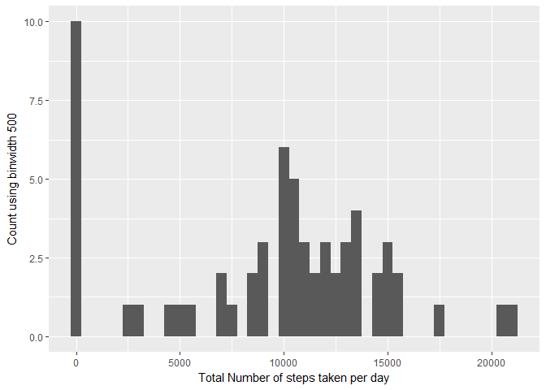
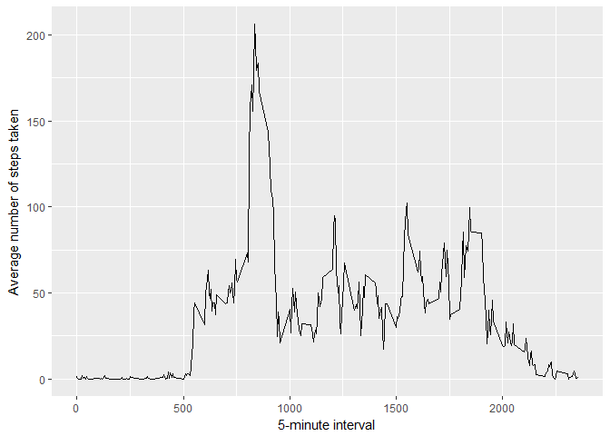
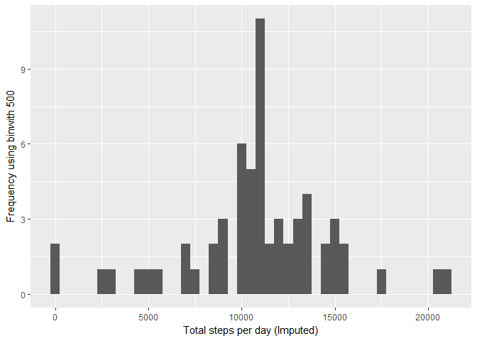
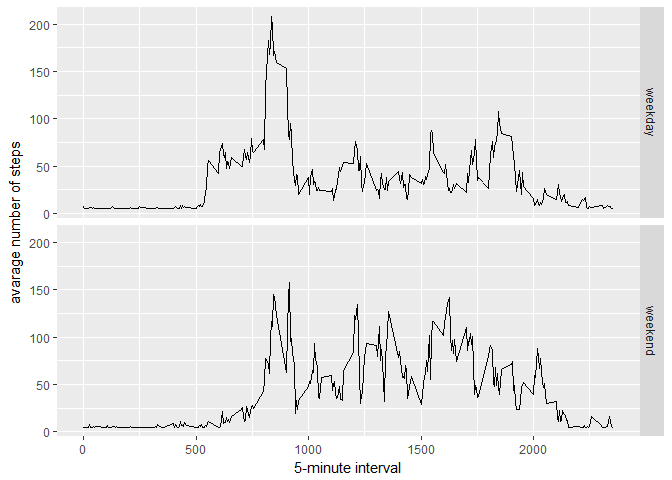

# Reproducible Research: Peer Assessment 1


## Loading and preprocessing the data


```r
library(tidyr)
mydata <- read.csv("C:\\JohnsHopkins\\RepData_PeerAssessment1\\activity\\activity.csv")
head(mydata)
```

```
##   steps       date interval
## 1    NA 2012-10-01        0
## 2    NA 2012-10-01        5
## 3    NA 2012-10-01       10
## 4    NA 2012-10-01       15
## 5    NA 2012-10-01       20
## 6    NA 2012-10-01       25
```

## What is mean total number of steps taken per day?

```r
library(ggplot2)
StepsTakenPerDay <- tapply(mydata$steps, mydata$date, sum, na.rm=TRUE)
qplot(StepsTakenPerDay, xlab="Total Number of steps taken per day", ylab="Count using binwidth 500", binwidth=500)
```

<!-- -->


```r
StepsTakenPerDay <- tapply(mydata$steps, mydata$date, sum, na.rm=TRUE)
Mean_StepsTakenPerDay <- mean(StepsTakenPerDay)
Median_StepsTakenPerDay <- median(StepsTakenPerDay)
Mean_StepsTakenPerDay
```

```
## [1] 9354.23
```

```r
Median_StepsTakenPerDay
```

```
## [1] 10395
```
## What is the average daily activity pattern?

```r
library(ggplot2)
myaverages <- aggregate(x=list(steps=mydata$steps), by=list(interval=mydata$interval),
                      FUN=mean, na.rm=TRUE)
ggplot(data=myaverages, aes(x=interval, y=steps)) +
    geom_line() +
    xlab("5-minute interval") +
    ylab("Average number of steps taken")
```

<!-- -->

```r
myaverages[which.max(myaverages$steps),]
```

```
##     interval    steps
## 104      835 206.1698
```


## Imputing missing values

```r
RowswithNA <- length(which(is.na(mydata$steps)))
RowswithNA
```

```
## [1] 2304
```

```r
library(scales)
library(Hmisc)
```

```
## Loading required package: lattice
```

```
## Loading required package: survival
```

```
## Loading required package: Formula
```

```
## 
## Attaching package: 'Hmisc'
```

```
## The following objects are masked from 'package:base':
## 
##     format.pval, round.POSIXt, trunc.POSIXt, units
```

```r
mydataImputed <- mydata
mydataImputed$steps <- impute(mydata$steps, fun=mean)
StepsByDayImputed <- tapply(mydataImputed$steps, mydataImputed$date, sum)
qplot(StepsByDayImputed, xlab='Total steps per day (Imputed)', ylab='Frequency using binwith 500', binwidth=500)
```

<!-- -->

```r
StepsByDayMeanImputed <- mean(StepsByDayImputed)
StepsByDayMedianImputed <- median(StepsByDayImputed)
StepsByDayMeanImputed
```

```
## [1] 10766.19
```

```r
StepsByDayMedianImputed
```

```
## [1] 10766.19
```
### Do these values differ from the estimates from the first part of the assignment? 
 Yes. These mean and median are higher
 
### What is the impact of imputing missing data on the estimates of the total daily number of steps
 Distribution of data is even and it is not left skewed

## Are there differences in activity patterns between weekdays and weekends?


```r
mydataImputed$dateType <-  ifelse(as.POSIXlt(mydataImputed$date)$wday %in% c(0,6), 'weekend', 'weekday')
averagedmydataImputed <- aggregate(steps ~ interval + dateType, data=mydataImputed, mean)
ggplot(averagedmydataImputed, aes(interval, steps)) + 
    geom_line() + 
    facet_grid(dateType ~ .) +
    xlab("5-minute interval") + 
    ylab("avarage number of steps")
```

<!-- -->
